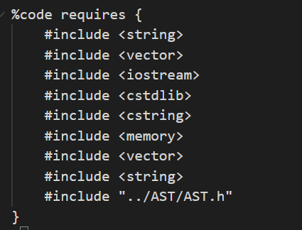
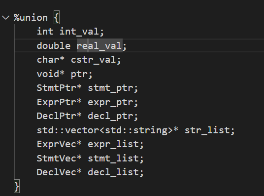
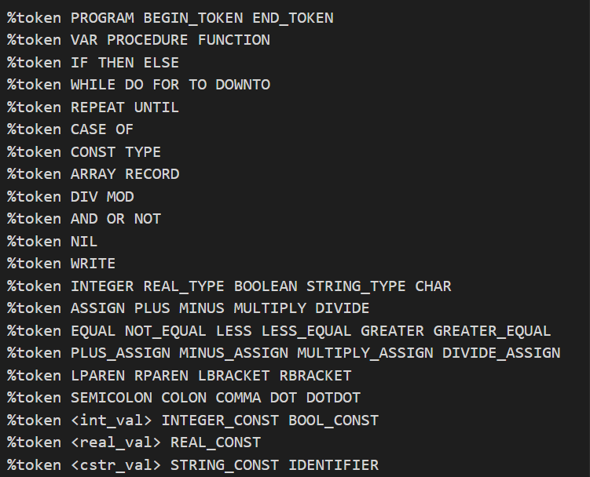
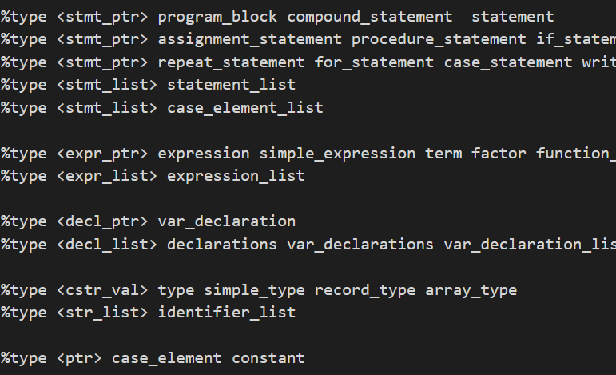

# 说明文档
## parser.y
使用bison实现的LALR状态机

3rdparty/win_flex_bison/win_bison.exe 读取 parser.y 生成中间代码会存放在build构建目录中，名为parser.cpp 和 parser.tab.h。这两个代码的作用就是构建LALR状态机

这里放的是前向的库引用，这里的c++代码会插入到生成的parser.tab.h最顶端


这里定义状态机内的枚举变量，每一个终结符和非终结符都是下列类型中的一种。



使用%token定义终结符，这里的名字需要与lex.l里定义的终结符对应，同样的如果需要在lex.l中添加新的词法分析也需要同步在这里添加。


使用 %type<...> 定义非终结符。非终结符必须要有一个类型对应到%union中。这些非终结符会出现在下面的文法里


文法定义：
```cpp
if_statement: 
  IF expression THEN statement //产生式
  //产生式后的大括号内插入c++代码，在使用该产生式归约时会调用他们
  {
    //$$ 占位符，代表产生式的左端
    //$1,$2,$3... 占位符，代表产生式的右边的第1/2/3个符号
    //符号具体的类型在 %type<...>中已有定义
    $$=new StmtPtr(std::make_shared<IfStmt>(*((ExprPtr*)$2),*((StmtPtr*)$4),nullptr));
    
    //这里表示构建一个IfStmt智能指针，转换为StmtPtr*并返回，
    //IfStmt在 /src/Core/AST/Statements.h 中定义。用于生成c++代码
    //析构$2,$4的指针，防止内存泄漏
    delete (ExprPtr*)$2;
    delete (StmtPtr*)$4;
  }

  | IF expression THEN statement ELSE statement //第二个产生式
  {
    $$=new StmtPtr(std::make_shared<IfStmt>(*((ExprPtr*)$2),*((StmtPtr*)$4),*((StmtPtr*)$6)));
    delete (ExprPtr*)$2;
    delete (StmtPtr*)$4;
    delete (StmtPtr*)$6;
  }
  ; // 结尾

```


## lex.l
使用lexer的词法分析器，lex.l引用parser.tab.h,
生成/build/lexer.cpp
目前完成了绝大多数词法的分析
## AST

这里是项目主要的代码书写，对应parser.y中的非终结符最终构造的类型。
ASTNode是基类，相当于语法树的结点，codeGen()用于递归地生成代码。

parser.y的构造器最终会返回ProgramAST的uptr，存放在静态存储区，使用getAST()获得引用。


目前只实现了很少一部分
还没有实现的：
1. Declaration几乎没有完成
2. 需要一个全局符号表，用于构建语义
3. 需要错误定位和错误恢复（）